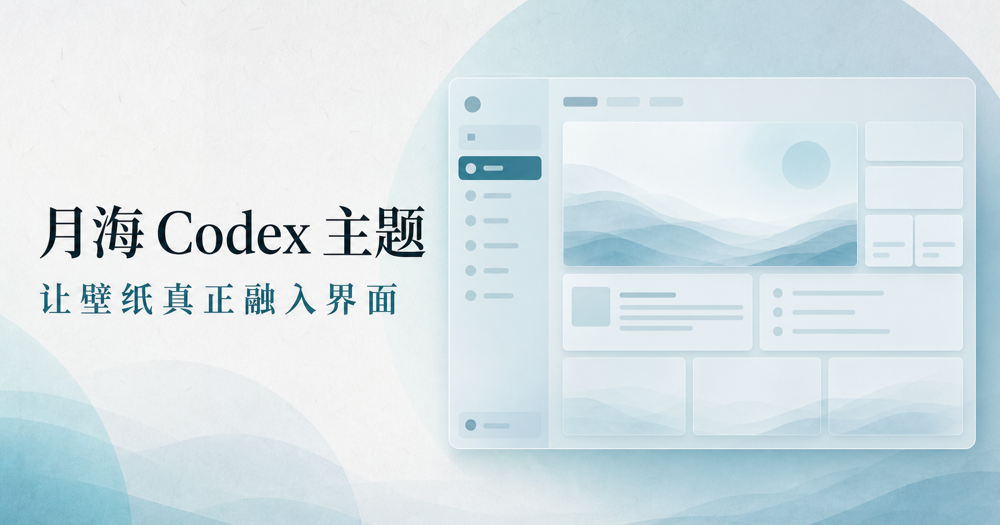

# Codex 月海主题

免费沉浸式 Codex 桌面主题。支持 Windows 与 macOS：下载安装月海版后，可从网页主题墙一键换肤，无需重启，也不会修改官方 Codex。

[官网](https://moonsea.kevinsu.xyz/) · [主题墙](https://moonsea.kevinsu.xyz/themes) · [下载最新版](https://moonsea.kevinsu.xyz/download)

## 最新壁纸批次

2026 年 8 月 11 日，月海主题墙上线四张原创主题：赤沙云网编织师、磁沙月面舞台、失重阀门鸭修班、天顶潮汐列车。四张主题均支持网页预览与月海助手一键应用，完整图文记录见[更新日志](https://moonsea.kevinsu.xyz/updates)。

> Free immersive themes for the Codex desktop app, with one-click switching from the web on Windows and macOS.

在网页点一下，已经打开的 Codex 会马上换主题。

## 使用

1. 打开[月海主题官网](https://moonsea.kevinsu.xyz)，点击“下载”，网站会自动提供 Windows 或 macOS 安装包。
2. Windows 运行 `Moonsea-Codex-Windows-x64-Setup.exe`；macOS 解压后右键打开 `Install.command`。
3. 打开桌面的“Codex 月海版”，回到官网选择主题。

- 普通壁纸：免费的渐变壁纸。
- Pro 壁纸：制作更精良的精选图片壁纸。

两类壁纸使用同一套月海透明表面、正文增强、助手与自定义壁纸能力。

## 使用数据

月海 Codex 运行期间会在启动时及之后每 5 分钟上报一次随机安装标识、版本、操作系统、架构和上报时间，用于统计安装设备与活跃趋势。助手与月海 Codex 进程绑定，退出月海后停止上报。

上报负载不包含 Codex 账号、邮箱、提示词、项目名称、文件路径、IP 地址、原始 User-Agent 和壁纸内容，业务数据库也不保存 IP。服务端只保留每台安装的首次与最后活跃时间，不保存每次心跳明细。

官网使用一年期第一方随机访客标识按浏览器去重访客（UV），服务端只保存哈希；不采集账号、硬件指纹、原始 IP 或原始 User-Agent。页面访问与来源同时按日期聚合统计。清除站点数据或更换浏览器后会视为新访客。

完整使用说明见 [GitHub Wiki](https://github.com/413162826/moonsea-codex-theme/wiki)。

## 更新

打开 Codex 里的“月海助手”。发现新版后，点击“立即更新”即可。

- 助手下载与官网相同的 Windows 安装程序，完成 SHA-256 校验后静默升级。
- 下载中断会保留进度；重新打开助手后会继续下载或复用已经校验完成的安装程序。
- 安装程序接管后关闭旧版，完成升级并自动重新打开月海 Codex。
- 官方 Codex 升级后，下次启动月海会自动基于最新版官方应用重建独立副本。
- 登录、设置、自定义壁纸与浏览器资料均保留。
- 仍在使用 ZIP 版的用户只需最后手动安装一次新版 `Setup.exe`，之后都在助手内更新。

## 卸载

Windows 打开“设置 → 应用 → 已安装的应用”，找到“月海 Codex”并点击卸载。macOS 运行安装包里的 `Uninstall.command`。官方 Codex、登录资料和用户设置不受影响。

## 添加 Pro 壁纸

1. 把原图放进 [`assets/wallpapers`](./assets/wallpapers/)（建议 2560×1440 以上）。
2. 在 [`src/wallpaper-catalog.mjs`](./src/wallpaper-catalog.mjs) 增加一条壁纸信息。
3. 运行 `npm run wallpapers` 预览，提交后官网和安装包会自动收录。
